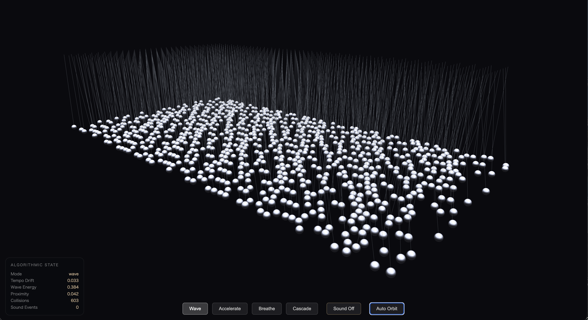

# Pendulum Wave

Interactive 3D live mobile with 900 chrome balance balls, algorithmic motion, and proximity-driven sound.



## Overview

`Pendulum Wave` is a browser-based artwork built with `Three.js` and `Web Audio API`.

This project is not a pre-rendered loop and not a simple offset animation such as many `sin(t + offset)` motions arranged in parallel.

Instead, 900 spheres continuously update their behavior through:

- local proximity
- alignment
- avoidance
- energy recovery and loss
- rhythm-gated sound triggering

The result is a persistent algorithmic structure where order, drift, collision avoidance, and sound emerge over time.

## Core Idea

- 900 chrome spheres are suspended as a live 3D field
- each sphere behaves through local rules instead of fixed choreography
- sound is generated from proximity and rhythm logic
- subtle wire glow reveals emitted events
- the system keeps running as an active computational object

## Demo

[](https://youtu.be/cFUZgv4QyCs)

Main approved artwork:

- [pendulum_wave_ordered_chaos_resonance.html](./artwork/approved/pendulum_wave_ordered_chaos_resonance.html)

Approved PV HTML source:

- [pendulum_wave_demo_pv_20s.html](./demos/pendulum_wave_demo_pv_20s.html)

The PV is also available as standalone HTML, not only as a recorded video.

That is part of the project itself: the video-style presentation is generated as code, and the code is included in this repository.

## Built With CLI

This repository also documents a process-based aspect of the work.

The artwork and the PV HTML were developed through iterative collaboration in CLI-based coding workflows, and the resulting HTML artifacts are intentionally kept in the repository.

This means visitors can inspect:

- the approved artwork HTML
- the PV HTML source
- the supporting requirements and development documents

## Artist Note

I wanted this work to be a world that keeps being active.

To let go.  
To circulate.  
To remain live.  

And from within that, to allow movements and sounds to appear that are still unknown to me.

`Pendulum Wave` is a 3D live mobile created for that purpose.

## Project Structure

```text
.
├── artwork/
│   └── approved/
│       └── pendulum_wave_ordered_chaos_resonance.html
├── demos/
│   └── pendulum_wave_demo_pv_20s.html
├── docs/
│   ├── development_specification.md
│   └── requirements_definition.md
├── research/
│   ├── prototypes/
│   └── studies/
├── screenshots/
│   └── ui-overview.png
├── LICENSE
├── README.md
└── README_draft.md
```

## Features

- `30 x 30` grid of live spheres
- chrome / steel material look
- local motion system with non-overlap constraints
- one-octave shared sound palette
- rhythm-gated audio events
- subtle wire glow traces
- live metrics overlay
- PV variant for short-form video capture

## Technical Stack

- `HTML`
- `JavaScript`
- `Three.js`
- `Web Audio API`

## How To Run

Open the approved HTML file in a modern desktop browser.

Recommended:

- macOS
- Google Chrome

Example:

```text
artwork/approved/pendulum_wave_ordered_chaos_resonance.html
```

For audio playback, user interaction is required because of browser audio policies.

## Controls

- **Wave / Accelerate / Breathe / Cascade** — switch behavioral mode
- **Sound Off / On** — toggle audio output
- **Auto Orbit** — toggle automatic camera rotation
- Mouse drag to orbit the camera manually

## Development Notes

Two documents define the project more formally:

- [requirements_definition.md](./docs/requirements_definition.md)
- [development_specification.md](./docs/development_specification.md)

Use the requirements document for artistic and system intent.

Use the development specification for implementation structure, state model, event rules, and future skill conversion.

## What This Project Is Not

- not a flat AI video
- not a pre-rendered loop
- not a fixed music sequencer
- not a simple grid of delayed sine waves

## Future Directions

- additional temporal themes such as `waltz`, `canon`, `heartbeat`, `hototogisu`
- refined camera choreography for PV capture
- better export tooling for recorded outputs
- possible Codex skill conversion for future iterations

## License

This project is released under the `MIT` License.

See [LICENSE](./LICENSE).

## Credit

Original concept and implementation direction by **wory**.

Created by **wory-bonbon**.

Built with **Codex & Claude Code & Claude Opus 4.6**.

If you reuse or adapt this project, please retain credit to the original project and concept.

Suggested repository credit line:

> Original concept and implementation direction by wory. Created by wory-bonbon. Built with Codex & Claude Code & Claude Opus 4.6.
